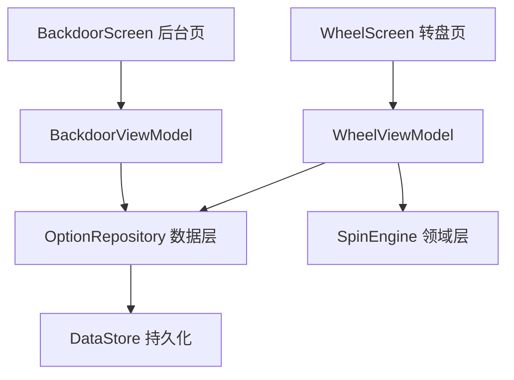

# 多轮后台指定队列（Backdoor Multi-Spin Queue）

Feature Name: 2026-08-02-backdoor-multi-spin
Updated: 2026-08-02

## Description

将隐藏后台控制的单一强制结果升级为有序的强制结果队列。主办方在后台可依次追加多个指定（第 1 次、第 2 次……），每次旋转按序消费队列头部一个指定，队列耗尽后自动恢复随机模式。同一选项允许重复出现；转盘主页面全程无痕，不显示任何作弊提示。

## Architecture



与现有 MVVM 分层一致。核心改动在数据模型（`forcedOptionId` 单值 → `forcedQueue` 列表）与消费逻辑。

## Components and Interfaces

### 数据模型（WheelModels.kt）

- `WheelConfig.forcedOptionId: String?` 移除，替换为 `forcedQueue: List<String> = emptyList()`
- `WheelConfig.normalized()` 对队列做选项存在性过滤与去空处理（保留顺序与重复）

### 数据层（OptionRepository.kt）

- `setForcedOption(optionId: String?)` 替换为：
  - `enqueueForcedOption(optionId: String)` — 追加到队列末尾
  - `removeForcedOption(optionId: String)` — 移除指定项（移除该选项首次出现的位置，保留其余出现）
  - `clearForcedOptions()` — 清空队列
  - `consumeForcedHead()` — 消费队列头部（供旋转完成后调用）

### 领域层（SpinEngine.kt）

- `computeTargetRotation(options, forcedOptionId: String?, currentRotation)` 签名不变，调用方传入队列头部作为 `forcedOptionId`；为空则走随机分支。无需修改引擎本身。

### 后台 ViewModel（BackdoorViewModel.kt）

- `forceNext(optionId: String?)` 替换为 `enqueue(optionId: String)`、`removeAt(optionId: String)`、`clearAll()`
- 暴露 `config` 中的 `forcedQueue` 供界面展示顺序

### 后台界面（BackdoorScreen.kt）

- 顶部状态卡：显示队列长度（如「已指定 N 轮，第 1 次=…，第 2 次=…」），提供「清空指定」按钮
- 选项列表点击：调用 `enqueue` 追加到队列
- 新增队列预览区：按「第 N 次」顺序列出队列内容，每项可单独移除

### 转盘 ViewModel（WheelViewModel.kt）

- `performSpin()` 中读取 `cfg.forcedQueue.firstOrNull()` 作为本次强制目标
- 旋转完成后调用 `repository.consumeForcedHead()` 移除队列头部；若队列为空则不动

### 持久化兼容

- 旧数据中仅存在 `forcedOptionId` 的，通过 `normalized()` 迁移：`forcedOptionId != null && forcedQueue.isEmpty()` 时转为 `forcedQueue = listOf(forcedOptionId)`，随后归一化写入时不再保留旧字段值

## Data Models

```kotlin
@Serializable
data class WheelConfig(
    val options: List<WheelOption> = defaultOptions(),
    val password: String = DEFAULT_PASSWORD,
    val forcedOptionId: String? = null,   // 旧字段，保留用于迁移，normalized 后写入 forcedQueue
    val forcedQueue: List<String> = emptyList(),
)
```

- `forcedQueue` 为有序列表，元素为选项 ID，允许重复
- 队列消费采用「头部出队」语义：`forcedQueue.firstOrNull()` 为下一次目标，消费后 `drop(1)`

## Correctness Properties

- 不变量：队列中每个元素都对应一个仍存在的选项（删除选项时同步清理引用）
- 不变量：一次旋转只消费一个指定，绝不跳过或重复消费
- 消费语义：旋转结束、记录历史之后才消费头部，保证崩溃恢复时不会误丢指定
- 队列耗尽后 `forcedQueue` 恢复空列表，行为与随机模式完全一致

## Error Handling

- 选项被删除而队列仍引用：在 `updateOptions` 中过滤失效 ID
- 队列消费时列表为空（异常场景）：空转安全，直接走随机分支
- JSON 反序列化失败：`decode` 已容错回退默认配置

## Test Strategy

- 领域层新增 `ForcedQueueTest`：
  - 追加保持顺序与重复
  - 头部消费后顺序前移
  - 空队列消费安全
- 数据层 `WheelModelsTest` 补充：
  - `normalized()` 对队列的存在性过滤与去空
  - 旧 `forcedOptionId` 字段迁移到 `forcedQueue`
  - JSON 序列化往返保留顺序与重复
- `SpinEngineTest`：传入队列头部作为强制目标，验证指定结果必然收敛（现有测试复用）

## References

[^1]: (.monkeycode/specs/2026-08-02-backdoor-multi-spin/requirements.md) - 需求文档
[^2]: (app/src/main/java/com/example/wheelpicker/data/model/WheelModels.kt) - 数据模型
[^3]: (app/src/main/java/com/example/wheelpicker/domain/SpinEngine.kt) - 领域引擎
[^4]: (app/src/main/java/com/example/wheelpicker/ui/backdoor/BackdoorScreen.kt) - 后台界面
[^5]: (app/src/main/java/com/example/wheelpicker/ui/wheel/WheelViewModel.kt) - 转盘状态机
