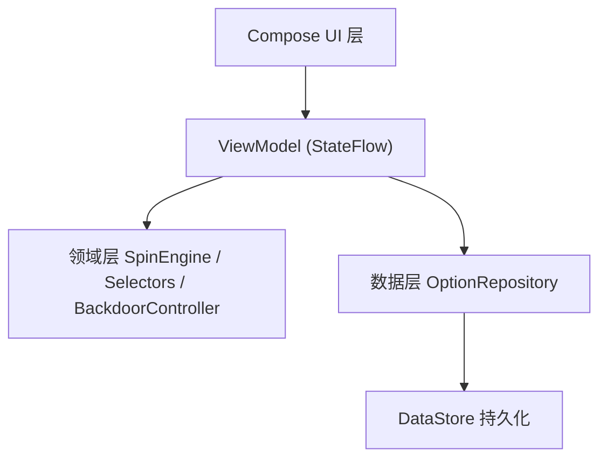

# 转盘选择（Wheel Picker）

一个功能完整的安卓转盘选择 App。可自由编辑转盘上的选项文字、颜色与权重，点击旋转后按权重概率抽取结果；内置**隐藏后台控制**，活动主办方可通过密码进入后台，为后续多次旋转依次指定结果。适用于活动抽奖、课堂点名、团队决策、聚餐选择等场景。

- 纯本地运行，数据不上传云端，隐私安全
- 无广告、无需登录注册，开箱即用
- 旋转动画流畅，结果可复现可核对

## 功能特性

### 转盘展示

- 圆形转盘由 Compose Canvas 自绘，扇区数量与选项数实时对应，增删选项即时反映到画面
- 每个扇区使用对应选项的颜色填充，并显示选项文字
- 扇区文字沿扇区中分角居中排布，字号随扇区大小与文字长度自动缩放，长文字也能完整显示
- 中心固定指针（尖端朝上）与中心轴点，旋转结束后指针精确停在结果扇区正中，永不落在扇区缝隙
- 支持旋转中动画缓动减速，模拟真实转盘的手感

### 自由编辑

- **增删选项**：添加、删除任意选项，实时预览
- **文字编辑**：修改选项文字，保存后立即同步到转盘
- **颜色编辑**：12 色预设色板自由选择，新增选项自动分配未使用的颜色，避免相邻扇区同色
- **权重编辑**：设置 1-100 权重，决定选项被抽中的概率占比
- **恢复默认**：一键恢复内置的 6 个示例选项，方便快速回到初始演示状态
- 选项数量限制：最少 2 个、最多 20 个

### 权重随机

- 扇区角度按 `权重 / 权重总和 × 360°` 计算，扇区越大被抽中概率越高
- 随机选择基于累积权重区间的均匀抽样，统计上精确等于权重占比（测试中用 10 万次抽样、2% 容差验证）
- 旋转动画至少 4-8 圈，配缓动曲线模拟真实转盘减速停止
- 全部选项权重相等时，各选项被选中的概率完全一致

### 隐藏后台控制

- **隐蔽入口**：转盘页顶部标题区域连续快速点击 5 次触发密码框
- **密码保护**：默认密码 `8888`，可进入独立页面随时修改
- **多轮指定**：在后台依次点选选项，可排定「第 1 次、第 2 次……」结果队列，一次设置连续多轮
- **按序生效**：每次旋转依次消费队列头部指定，队列耗尽自动恢复随机
- **队列管理**：后台页可预览完整队列，单独移除某项或一键清空全部指定
- **无痕作弊**：指定期间主转盘页无任何提示，与随机模式视觉完全一致，参与者无法察觉

### 历史记录

- 每次抽取自动记录结果选项与精确时间戳
- 历史按时间倒序排列，支持一键清空
- 方便事后核对抽奖过程与公平性

### 数据持久化

- 配置（选项、颜色、权重、后台密码、指定队列）与历史记录均通过 DataStore 本地保存
- 应用重启后完整恢复，无需重新设置
- 所有数据仅存于设备本地，卸载应用即清除

## 技术栈

| 类别 | 选型 |
|------|------|
| 语言 | Kotlin 2.0 |
| UI | Jetpack Compose + Material 3 + Navigation Compose |
| 架构 | MVVM + 单向数据流（StateFlow） |
| 绘制 | Compose Canvas 自定义绘制 + Animatable 旋转动画 |
| 持久化 | Preferences DataStore + kotlinx.serialization JSON |
| 构建 | Gradle 8.7 + AGP 8.5.2 |
| 测试 | JUnit 4 单元测试 |

## 下载

最新可安装包（`wheel-picker-v1.0.0.apk`）发布在 GitHub Releases：

https://github.com/fvfpq/wheel-picker/releases/tag/v1.0.0

> 安装时需在系统设置中允许「安装未知来源应用」。

## 环境要求

- 运行设备：安卓 8.0（API 26）及以上
- 开发环境：JDK 17、Android Studio（Ladybug 或更新版本）

## 快速开始（安装运行）

1. 从 GitHub Releases 下载 `wheel-picker-v1.0.0.apk`
2. 将 APK 传输到手机（数据线 / 网盘 / 即时通讯工具均可）
3. 点击 APK 安装，系统提示时允许「安装未知来源应用」
4. 打开 App，进入转盘页，点击底部「开始旋转」即可抽选

## 构建运行（开发者）

### 构建步骤

```bash
# 1. 下载代码
git clone https://github.com/fvfpq/wheel-picker.git

# 2. 用 Android Studio 打开项目根目录
#    等待首次 Gradle Sync 完成（会下载依赖，需联网）

# 3. 生成 APK
#    Build → Build App Bundle(s) / APK(s) → Build APK(s)

# 4. 或连接手机（开启 USB 调试）直接点击工具栏 Run ▶ 安装运行
```

APK 输出路径：`app/build/outputs/apk/debug/app-debug.apk`，将该文件传到手机点击即可安装（需在系统设置中允许「安装未知来源应用」）。

### 运行单元测试

```bash
# 在 Android Studio 中打开 app/src/test 下的测试类，点击运行
# 或命令行执行
./gradlew testDebugUnitTest
```

## 使用指南

### 日常使用

1. 打开 App 进入转盘页，底部点击「开始旋转」
2. 旋转结束后弹窗展示抽取结果，并自动记入历史
3. 点击左上角编辑按钮调整选项、颜色、权重
4. 点击右上角历史按钮查看历史记录
5. 想重置演示数据时，进入编辑页点击「恢复默认」

### 编辑选项

1. 进入编辑页，可增删选项、修改文字
2. 点击选项色块打开 12 色色板选择颜色
3. 点击权重输入框设置 1-100 的权重值（越大越容易被抽中）
4. 返回转盘页即看到更新后的转盘

### 后台指定结果（主持人专用）

1. 在转盘页顶部标题区域**连续快速点击 5 次**
2. 在弹出框中输入后台密码（默认 `8888`）
3. 进入后台页，依次点选选项，排定第 1 次、第 2 次……的指定结果队列
4. 可在队列预览区单独移除某项，或点「清空全部指定」
5. 返回转盘页点击旋转，每次旋转依次命中队列中的指定
6. 队列耗尽后自动恢复随机模式；后台页底部「修改后台密码」可进入独立页面修改密码

> 提示：请将密码告知可信主持人，避免普通参与者误入后台。

### 修改后台密码

1. 在后台页点击底部「修改后台密码」进入独立页面
2. 输入新密码并点击「保存密码」
3. 返回后台页，之后进入后台需使用新密码
4. 忘记密码时，删除应用数据可重置为默认密码 `8888`（同时清空历史与配置）

### 常见使用场景

- **活动抽奖**：设置奖品选项与权重，多轮指定队列可预先排定一等奖、二等奖的走向
- **课堂点名**：录入学生名单，随机点名，历史记录可核对是否公平
- **团队决策**：录入候选方案，抽选决定晚餐、团建方案等
- **聚餐选择**：快速从多个选择中随机决定

## 权限说明

应用仅使用本地存储功能，不申请任何敏感权限（无网络、定位、相机、麦克风等），数据完全保存在设备本地。

## 工程结构

```
wheel-picker/
├── settings.gradle.kts          # 工程配置
├── build.gradle.kts             # 根构建脚本
├── gradle.properties            # Gradle 参数
├── gradle/wrapper/              # Gradle Wrapper（固定构建版本）
└── app/
    ├── build.gradle.kts         # App 模块构建脚本
    ├── proguard-rules.pro       # 混淆规则
    └── src/
        ├── main/
        │   ├── AndroidManifest.xml
        │   ├── java/com/example/wheelpicker/
        │   │   ├── MainActivity.kt          # 应用入口
        │   │   ├── ServiceLocator.kt        # 依赖单例
        │   │   ├── domain/                  # 领域层（纯逻辑，可单元测试）
        │   │   │   ├── Selectors.kt         #   按权重随机 / 强制指定选择器
        │   │   │   ├── SpinEngine.kt        #   扇区角度计算与目标角度引擎
        │   │   │   └── BackdoorController.kt#   连点检测与密码校验
        │   │   ├── data/                    # 数据层
        │   │   │   ├── OptionRepository.kt  #   DataStore 读写封装
        │   │   │   └── model/WheelModels.kt #   数据模型与默认配置
        │   │   └── ui/                      # UI 层
        │   │       ├── AppNavigation.kt     #   导航图
        │   │       ├── wheel/               #   转盘页（绘制+旋转+入口）
        │   │       ├── edit/                #   编辑页（选项/颜色/权重）
        │   │       ├── backdoor/            #   后台控制页（含密码修改子页）
        │   │       ├── history/             #   历史记录页
        │   │       ├── components/          #   通用对话框组件
        │   │       └── theme/               #   主题
        │   └── res/                         # 资源（主题、图标）
        └── test/                            # 单元测试
            ├── domain/                      # 选择器/引擎/后台控制测试
            └── data/                        # 模型与序列化测试
```

## 架构说明

采用 MVVM + 单向数据流分层：



### 各层职责

- **UI 层**：纯声明式组合，只展示状态与分发事件，不持有业务逻辑
- **ViewModel 层**：维护转盘状态机（静止/旋转中）、配置流与后台控制，通过 StateFlow 单向驱动 UI
- **领域层**：转盘角度计算、权重随机、连点密码校验，不依赖 Android，可直接单元测试
- **数据层**：DataStore 持久化，配置以 JSON 整体序列化，提供幂等的队列读写接口

### 核心设计要点

- **单向数据流**：UI 只能通过 ViewModel 暴露的事件修改状态，避免状态不一致
- **领域层隔离**：随机算法、角度计算等核心逻辑与 Android 框架解耦，保证可测试性
- **无痕设计**：作弊队列状态仅在后台页可见，转盘主页面不渲染任何作弊痕迹
- **幂等消费**：旋转完成后才消费队列头部，异常崩溃不会重复消费指定

## 测试覆盖

单元测试覆盖以下核心逻辑：

- `RandomSelectorTest`：权重分布统计验证（10 万次抽样，容差 2%）
- `SpinEngineTest`：扇区角度和恒为 360°、角度到扇区唯一映射、指定结果必然收敛到目标扇区
- `BackdoorControllerTest`：连点计数窗口、密码校验、指定状态消费
- `WheelModelsTest`：权重钳制、标签裁剪、JSON 序列化往返、默认配置、指定队列归一化（顺序保持、重复保留、失效引用清理、旧字段迁移）

## 常见问题

**Q：安装 APK 提示「应用未安装」**
A：可能已安装同名应用，先卸载旧版本；或设备系统版本低于安卓 8.0。

**Q：忘记后台密码怎么办**
A：删除应用数据会重置为默认密码 `8888`，同时会清空历史记录与配置。

**Q：最多能添加多少选项**
A：20 个。选项过多时扇区会过窄，影响可读性。

**Q：权重具体如何影响概率**
A：选中概率 = 该选项权重 ÷ 全部选项权重之和。全部权重相等时，各选项概率完全一致。

**Q：后台指定队列最长能排多少轮**
A：无数量上限限制，可在一次进入后台时排定任意轮次，每轮旋转依次消费一个指定。

**Q：删除了选项，队列里还指向它怎么办**
A：系统会在保存时自动清理失效引用，被删除选项的指定自动从队列移除，不影响其余指定。

**Q：App 需要联网吗**
A：不需要。所有数据本地存储，不请求任何网络权限。

## 项目状态

当前版本 1.0.0，已完成全部规划功能。后续可扩展方向：选项图标、转盘音效、局域网远程控制端、导出历史记录。

## 贡献者

- [fvfpq](https://github.com/fvfpq/wheel-picker)

感谢所有为本项目提交过代码、Issue 或建议的贡献者！

## 许可证

本项目采用 [MIT License](LICENSE)。
