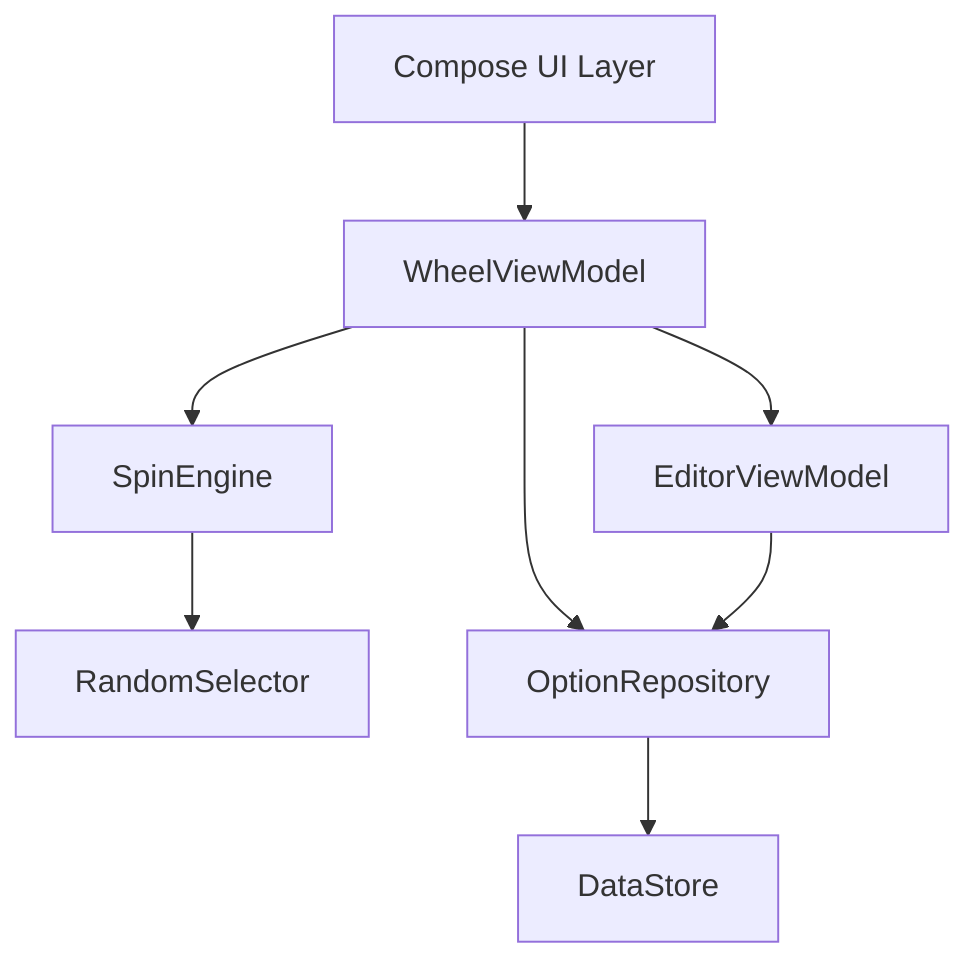

# Wheel Picker Android - Technical Design

Feature Name: wheel-picker-android
Updated: 2026-07-31

## Description

一个安卓转盘选择 App。采用 Kotlin + Jetpack Compose + Material3 实现，MVVM + 单向数据流架构。核心能力：

1. 转盘绘制与旋转动画（Canvas 自绘扇区 + 权重角度计算）
2. 选项自由编辑（文字 / 颜色 / 权重），DataStore 本地持久化

## Architecture



### 架构说明

- **UI 层**：纯 Compose 可组合函数，持有状态并分发事件，不包含业务逻辑
- **ViewModel 层**：`WheelViewModel` 维护转盘状态机（Idle/Spinning）与配置流；`EditorViewModel` 维护编辑会话
- **领域层**：`SpinEngine` 负责计算目标停止角度；`RandomSelector` 按权重随机选结果
- **数据层**：`OptionRepository` 封装 DataStore，以 JSON（kotlinx.serialization）持久化 `WheelConfig`

## Components and Interfaces

### 1. WheelCanvas

自绘转盘组件，接收选项列表与当前旋转角度：

```kotlin
@Composable
fun WheelCanvas(
    options: List<WheelOption>,
    rotationDegrees: Float,
    pointerAt: Float = -90f
)
```

- 按权重占比将 360° 划分为扇区
- 每个扇区使用 `drawArc` 绘制，颜色取自 `option.color`
- 扇区文字沿中分角旋转绘制，适配扇区宽度自动缩放字号
- 顶部固定绘制指针三角与中心圆点

### 2. SpinEngine

```kotlin
class SpinEngine(
    private val randomSelector: RandomSelector
) {
    // 返回最终总旋转角度（多圈 + 目标扇区对齐）
    fun computeTargetRotation(
        options: List<WheelOption>
    ): Float
}
```

- 目标扇区中心角 `targetAngle = sectorCenterAngle(selected)`
- 总旋转角 `= 基础圈数(4..8 随机) * 360 + (指针角度对齐) + targetAngle`
- 权重占比角度：`sectorAngle(i) = weight_i / sum(weights) * 360`

### 3. Selectors

```kotlin
fun interface OptionSelector {
    fun select(options: List<WheelOption>): WheelOption
}

class RandomSelector : OptionSelector // 按权重随机，uses kotlin.random
```

`RandomSelector` 通过累积权重区间实现概率分布，可单元测试验证统计公平性。

### 4. OptionRepository

```kotlin
class OptionRepository(private val context: Context) {
    val config: Flow<WheelConfig>
    suspend fun save(config: WheelConfig)
    suspend fun updateOptions(options: List<WheelOption>)
}
```

使用 Preferences DataStore，键 `wheel_config`，值序列化为 JSON。默认配置含 8 个示例选项（自动配色 + 等权重）。

## Data Models

```kotlin
@Serializable
data class WheelOption(
    val id: String,       // UUID，用于历史记录关联
    val label: String,    // 选项文字，非空
    val color: Long,      // ARGB 色值
    val weight: Int       // 1..100，默认 10
)

@Serializable
data class WheelConfig(
    val options: List<WheelOption> = defaultOptions(),
    val password: String = "8888"
)
```

历史记录单独存储在 DataStore 键 `spin_history`。

## Correctness Properties

- **扇区角度守恒**：所有扇区角度和恒等于 360°；由权重总和归一化保证
- **结果映射唯一**：给定最终角度 `f = finalRotation mod 360`，恰好落入唯一扇区 `i`，满足 `sectorStart(i) <= f < sectorStart(i) + sectorAngle(i)`
- **权重合法**：权重钳制于 [1, 100]，避免零权重扇区导致角度计算除零
- **旋转收敛**：旋转圈数至少 4 圈，保证动画可感知；停止角度永远对齐扇区中心而非边界
- **持久化原子性**：配置写入为整体替换，避免选项与颜色/权重部分写入造成不一致

## Error Handling

| 场景 | 处理策略 |
|------|---------|
| 选项数 < 2 触发旋转 | 阻止旋转，Toast 提示至少需要 2 个选项 |
| 提交空白选项文字 | 拒绝保存，表单内联错误提示 |
| 权重输入超出范围 | 失焦时钳制到 [1, 100] |
| DataStore 读取失败 | 回退默认配置并弹出一次性提示 |
| 旋转动画被外部中断（如切后台） | 状态机复位为 Idle，按当前角度收敛，不丢失配置 |

## Test Strategy

### 单元测试（JUnit + kotlin-test）

- `RandomSelector`：大规模抽样，验证统计概率近似权重占比（容差 2%）
- `SpinEngine`：给定选项集，验证最终角度必然映射回选中扇区中心
- 权重钳制、扇区角度求和 = 360°、结果映射唯一性

### UI 测试（Compose UI Test）

- 转盘页面渲染：给定配置渲染正确扇区数
- 编辑流程：添加 / 修改 / 删除选项后配置与扇区同步更新
- 旋转流程：点击旋转后状态进入 Spinning，结束后展示结果

## References

[^1]: (Android Developers) - [Compose Canvas 绘制](https://developer.android.com/develop/ui/compose/graphics/draw/overview)
[^2]: (Android Developers) - [DataStore](https://developer.android.com/topic/libraries/architecture/datastore)
